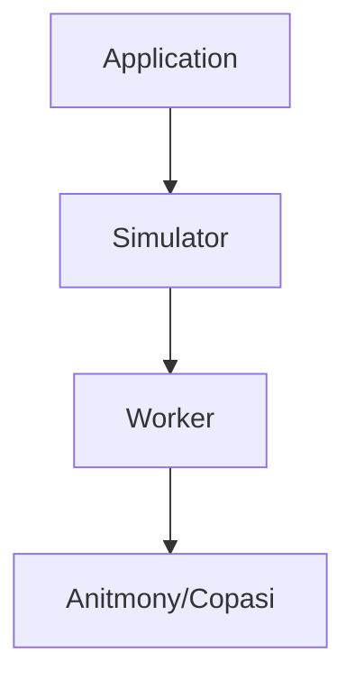

`libantimony` and `copasijs` have been vendored in the `public/` directory.

Application code interfaces with a Simulator class. This Simulator class manages a [Web Worker](https://developer.mozilla.org/en-US/docs/Web/API/Web_Workers_API/Using_web_workers). The Web Worker calls the Antimony/Copasi APIs directly.

When you want to add a new simulation feature, you will likely have to edit multiple files. Here are places to look:
 - `src/globals/simulation + src/globals/model` - these contain the Simulator instance and other various information about the model the user is typing.
 - `src/features/Simulator` - the Simulator interface. As of now, the only implementation is in `src/features/CopasiSimulator`.
 - `public/copasiWorker`

## worker interface

Workers are managed by `src/features/workerPool.ts`.

Workers are expected to send messages in a specific format which you can take a look at in that file (look for the `Action`, `Result`, and `ErrorResult` types).

## note about workers

We have web workers located in `public/`. I put them in `public/` so they can access the third party dependencies (those dependencies
import relative to the worker file, so it has to be at root). Unfortunately, this means we cannot include workers in our
build step.